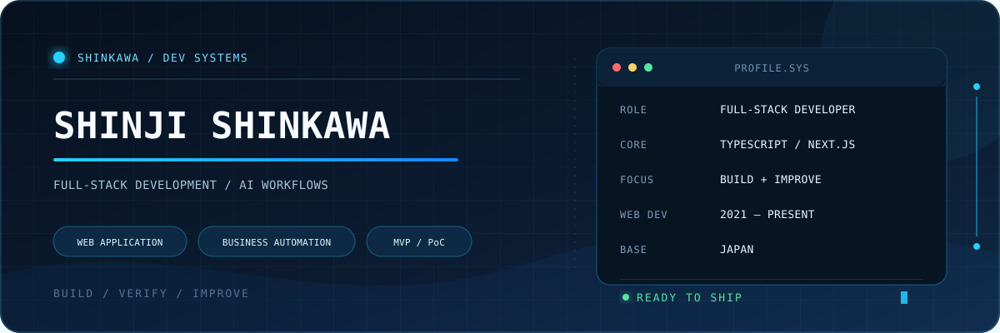

  

  
  

## About

React / Next.js / TypeScript / Node.js を中心に、業務WebシステムやAI機能の開発をしています。

2021年からWebエンジニアとして企業案件に参画し、toB / toC向けWebアプリケーション、管理画面、申込画面、業務支援システムなどを担当してきました。フロントエンドだけでなく、API、DB、クラウド、テスト、運用まで、案件に必要な範囲を横断して対応しています。

直近では、LLM APIを組み込んだ業務支援機能や、AIエージェントを使った調査・実装・検証フローにも取り組んでいます。

## What I work on

<table>
  <tr>
    <td width="50%" valign="top">
      <h3>Web application</h3>
      
toB / toC向けWebアプリ、管理画面、申込・問い合わせ画面、既存システムの改修。

    </td>
    <td width="50%" valign="top">
      <h3>AI & automation</h3>
      
LLM APIを組み込んだ業務支援機能、GAS・Spreadsheet・外部APIを使った業務自動化。

    </td>
  </tr>
  <tr>
    <td width="50%" valign="top">
      <h3>MVP / PoC</h3>
      
要件整理、技術調査、最小構成の実装、動作確認、納品用ドキュメントまで。

    </td>
    <td width="50%" valign="top">
      <h3>Web production</h3>
      
サーバー移行、PHP / WordPress、JavaScript / GSAPを使ったアニメーション実装。

    </td>
  </tr>
</table>

## Web production background

Web制作会社との協業では、サーバー移行や公開環境まわりの対応を担当していました。 
JavaScript / GSAPを使ったオープニングアニメーションや、動きのあるUIも実装しています。 
PHP / WordPressでは、バックエンドを含む機能改修、自社テーマの構築、保守運用にも携わりました。 
AI開発ツールが一般化する前から、フロントの演出、WordPressの内部実装、公開環境まで一通り手を動かしてきた経験があります。

## Tech stack

### Application

  
  
  
  
  
  
  

### Cloud & delivery

  
  
  
  
  

### AI & automation

  
  
  

## How I work

- 40名を超えるチームでの開発と、1人で要件確認から納品まで進める小規模開発の両方を経験しています。
- 実装だけで終わらせず、動作確認、レビュー対応、運用手順や検証結果のドキュメント化まで行います。
- AI開発ツールの出力は、仕様、セキュリティ、保守性、既存コードとの整合性を確認してから反映します。

## Links

- [Portfolio / AI導入相談・業務改善](https://www.shinkawa.dev/)
- [Zenn / 技術記事](https://zenn.dev/shinkawa)
